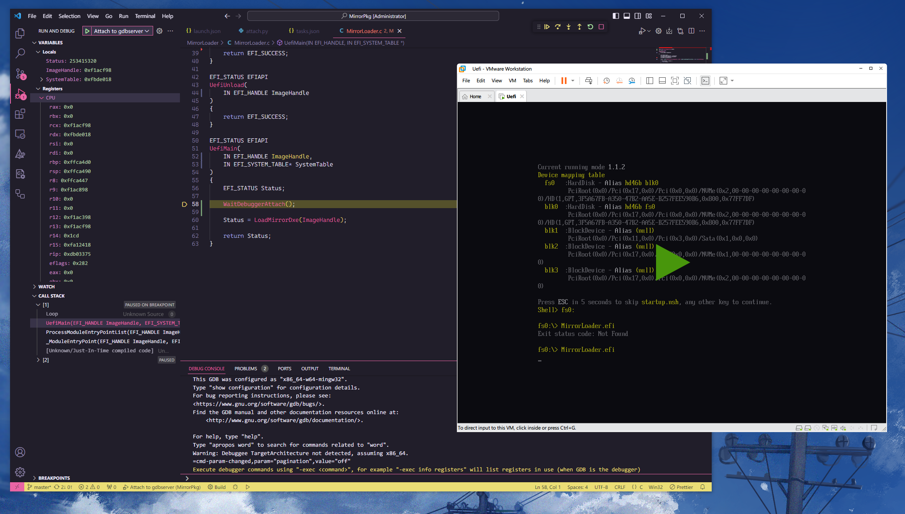

众所周知，UEFI 的调试其实是极其麻烦的事情（实际上开发过程中使用的 EDK2 工具链用起来也非常蛋疼，这里就不细说了），本篇将介绍 Windows 下使用 Vmware 进行源码级调试的方法，且其他平台下也可以同样适用。

## 环境

- GDB (要求 10.1 版本以上，后续我会说原因)
- Visual Studio Code (作为源码级调试的前端)
- VMware Workstation Pro (不解释)
- EDK2 (工具链)
- LLVM (编译器)

## 基本常识

- UEFI 程序的文件格式是 PE/COFF，这是由微软规范的一种文件格式，同时所对应的调试信息是 `Program Database`，也就是我们常见的 PDB 文件。
- VMware Workstation Pro 本身留有 gdbserver 协议调试接口，客户端可以通过 gdb 或 lldb 协议来调试。
- gdb 不支持载入 PDB 格式的调试信息，它仅支持 DWARF 格式的调试信息。
- lldb 支持 PDB 格式的调试信息和 DWARF 格式的调试信息，但是 lldb 的官方文档表示 PDB 格式的调试信息并未完全支持。

## VMware Workstation Pro

```
debugStub.listen.guest64 = "TRUE"
debugStub.hideBreakpoints= "TRUE"
```

关闭虚拟机以后，将这两条添加到虚拟机的.vmx 文件中，然后启动虚拟机(不要 Power On to Fireware，否则.vmx 内的内容会还原)，此时调试端口便会开启在`localhost:8864` 上，不需要其他的操作。

## EDK2

在 Windows 下，比较常见的编译器是 MSVC，但是 MSVC 无法生成 DWARF 格式调试信息，所以我们需要走另一个编译器，所以我们需要将工具链从 VS2019 切换到 CLANGDWARF。

```
build -p ${workspaceFolder}/SampleSourceLevelDebugPkg.dsc -t CLANGDWARF -a X64 -b NOOPT
build -p ${workspaceFolder}/SampleSourceLevelDebugPkg.dsc -t CLANGDWARF -a X64 -b DEBUG
build -p ${workspaceFolder}/SampleSourceLevelDebugPkg.dsc -t CLANGDWARF -a X64 -b RELEASE
```

此时我们的 UEFI 程序编译完成以后，便会看到两个文件，`.debug` 后缀的便是带有 DWARF 格式调试信息的文件。

## GDB

GDB 的版本要求 10.1 以上，原因是新版 DWARF 符号，在 10.1 以下的版本上无法完整解析，导致无法进行源码级调试。但是同时带来的一个问题是，10.1 以上的版本，会在加载 Program 的时候去发送一个 pGetTIBAddr 的包，VMware Workstation Pro 并不支持这个协议包，会导致 gdb 报一个错，但是无伤大雅。在 GDB 里，我们仅需两条命令就可以加载符号。

- target remote 127.0.0.1:8864
- add-symbol-file (调试信息文件路径) (UEFI 程序在内存中对应的 ImageBase + .text 节偏移，一般是 0x240)

此时，你使用便可以使用命令去直接反汇编函数了。

- disassmble UefiMain

## Visual Studio Code

这里的配置就不详细描述了，具体细节可以去看 [SampleSourceLevelDebugPkg](https://github.com/kanren3/SampleSourceLevelDebugPkg) 仓库。



## 结语

有任何其他的问题，都可以在评论区留言，看到以后我会及时回复。
