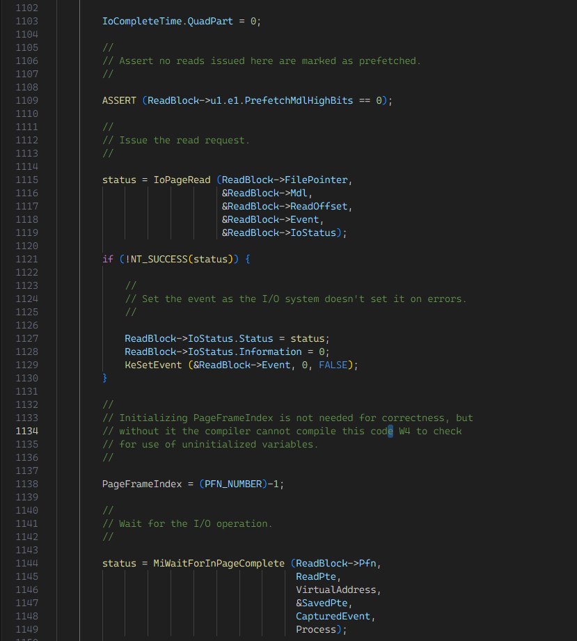
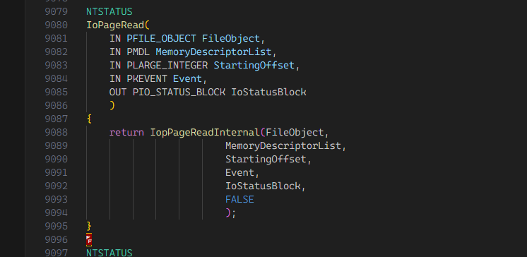
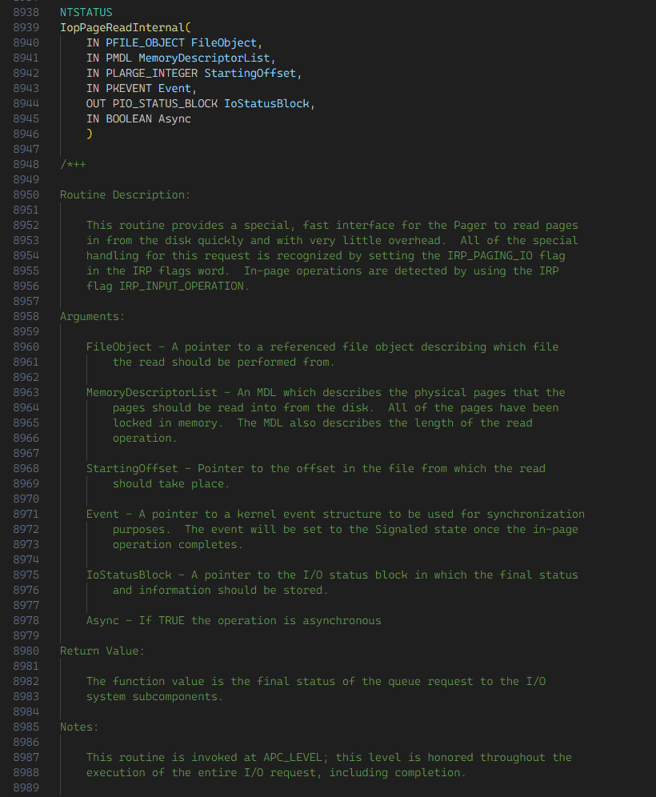
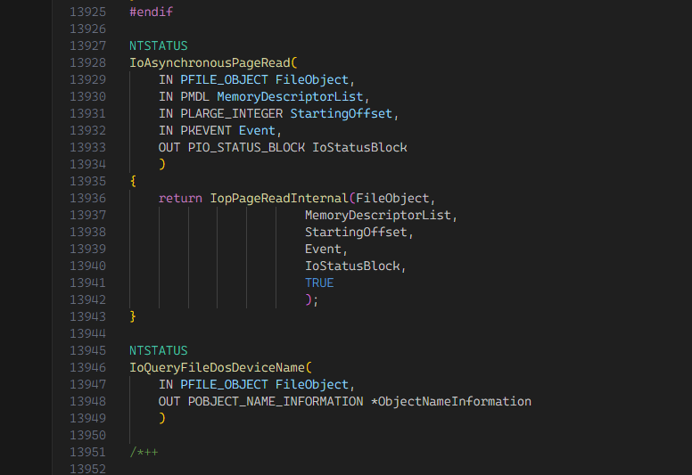
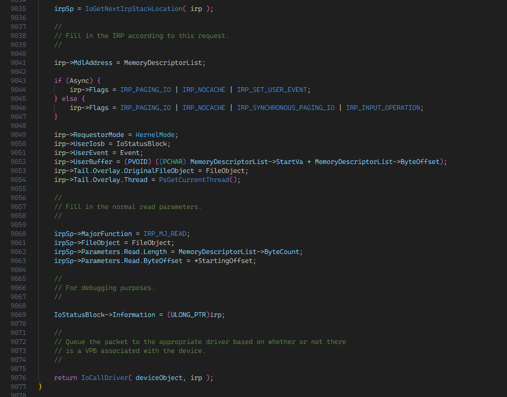
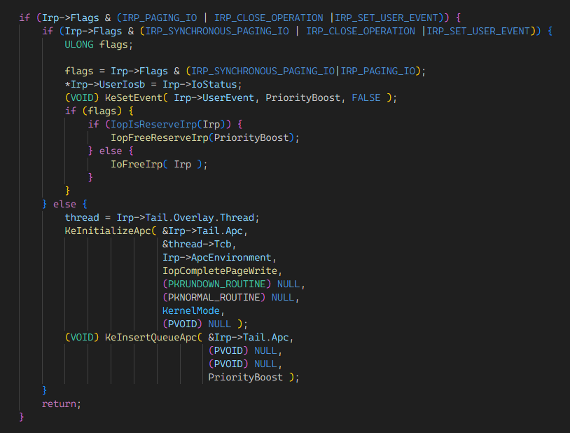
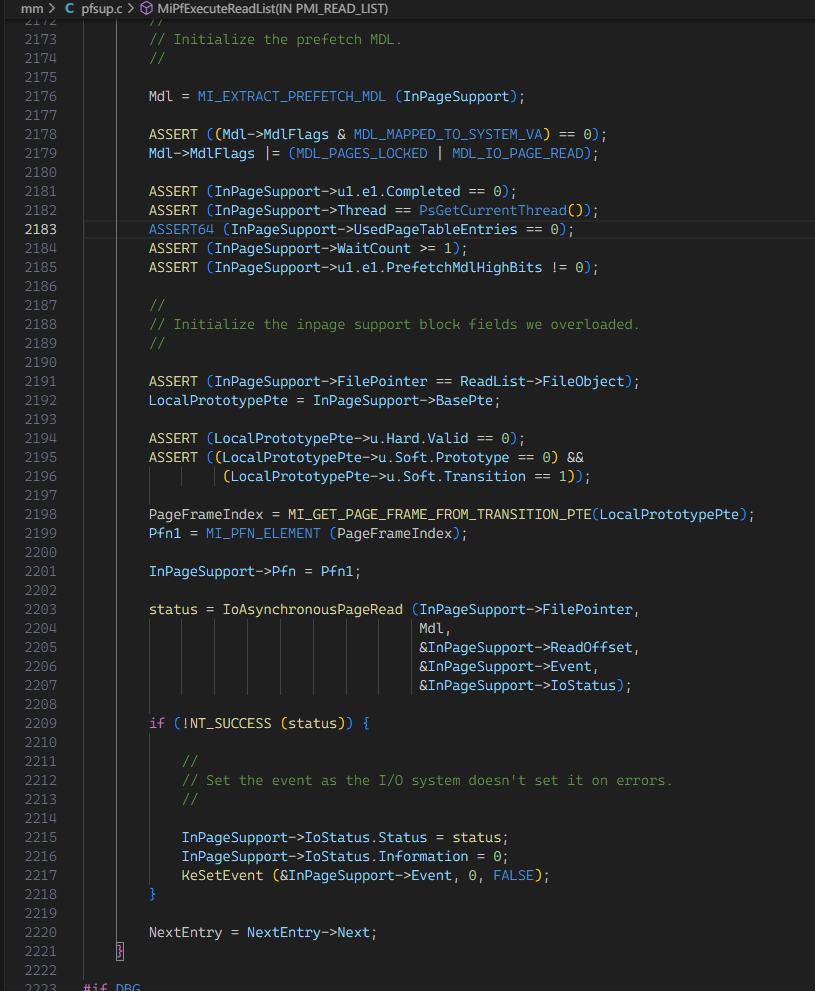
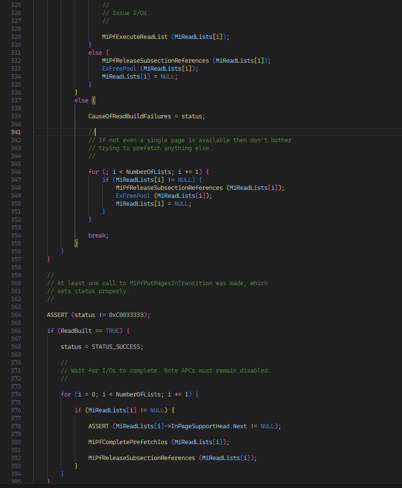
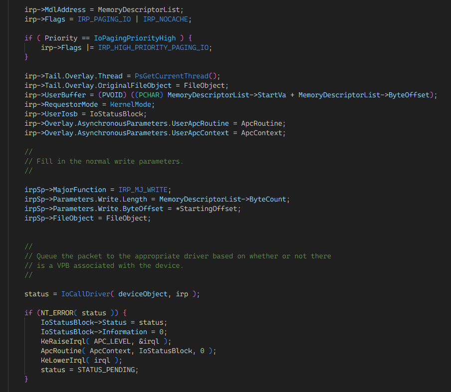

## 引言
<!-- markdownlint-capture -->
<!-- markdownlint-disable -->

> 阅读本文内容需要了解 Windows 内核，否则大概率会一脸懵逼。
{: .prompt-tip }
<!-- markdownlint-restore -->

相信搞 Windows 内核驱动开发的，都或多或少听说过 **IRQL** 这个东西，它的范围在 `0H~0FH` ，数值越大优先级越高，高优先级中断可以打断低优先级代码的执行，如果 **IRQL** 为 `0FH`，则相当于清除了 **EFlags.IF**，代码的执行永远不会被打断，**NMI** 除外。

而 IRQL 在 x64 下还有一个名字叫 **CR8** ，是从 **APIC** 映射过来的，不过本文并不会详细说明这些东西，大家可以自行去查阅资料。

## 分页内存

而在 Windows 内核驱动开发的过程中，我们在微软的 API 文档中，经常会见到下面表格中的东西，这个表规定了哪些 IRQL 下可以使用这个 API，违反这个规定，则有可能出现死锁或者蓝屏。

| Requirement     | Value            |
| --------------- | ---------------- |
| Target Platform | Universal        |
| Library         | NtosKrnl.lib     |
| DLL             | NtosKrnl.exe     |
| IRQL            | < DISPATCH_LEVEL |

其中 DISPATCH_LEVEL 下访问分页内存就是新手常犯的错误之一，当分页内存的物理页不存在的时候，需要通过触发 #PF，来将磁盘中的内存读取到物理内存中，而读取的过程中，需要调用到 `MmAccessFault` 函数，这个函数会检查 IRQL 是否小于 DISPATCH_LEVEL，如果不小于的话会直接调用 `KeBugCheckEx` 蓝屏。

## 文件读取

> Callers of **ZwReadFile** must be running at IRQL = PASSIVE_LEVEL and with special kernel APCs enabled.

有内核开发经验的朋友，应该有注意到过 `ZwReadFile` 这个 API 的文档下面，有这样一句话，这是因为文件系统的 I/O 完成是使用 **Special Kernel APC** 来实现的，如果当前 IRQL 处于 APC_LEVEL，或当前 **Special Kernel APC** 被禁用，则调用 API 会因为无法 Complete 而无限等待，也间接说明，文件读取的环境，必须可以交付 **Special Kernel APC**。

## 新的问题

既然文件读取的环境，要求必须可以交付 **Special Kernel APC**，为什么 IRQL 为 APC_LEVEL 的时候可以访问分页内存呢？访问分页内存的时候，系统不也应该向文件系统发起 I/O 请求吗？

这个问题的答案很简单，因为系统做过特殊的处理，下面我们直接来看 Windows 2003 的源码:

首先系统会调用 `IoPageRead` 去磁盘上读取分页内存。

------

这里我们看到 `IoPageRead` 是 `IopPageReadInternal` 的包装。

------

`IopPageReadInternal` 的最后一个参数 `Async`，表示 PageRead 的过程是异步还是同步，而 `IoPageRead` 传入的是 FALSE，所以 `IoPageRead` 是同步的。

------

既然有同步，自然也有异步的 `IoAsynchronousPageRead`，两者的区别后面会说。

------

`IopPageReadInternal` 确实在做 I/O 操作，根据 Async 给不同的 Flags，这个 Flags 在 I/O Complete 的时候会用到。

------

在 `IopfCompleteRequest` 里，找到了我们想要的东西，但是先前传入的 Flags 无论是同步还是异步，最后所执行的流程是完全一样的，都会去调 `KeSetEvent` 做同步处理，等于说 `IoAsynchronousPageRead` 和 `IoPageRead` 两个函数是没有任何区别的，`IoAsynchronousPageRead` 并不是真的异步操作。

------

在 `MiPfExecuteReadList` 中用到了 `IoAsynchronousPageRead`，但是不够，我们还需要再往上找。

------

再往上走一层，我们便可以知道为什么叫 **Asynchronous** ，因为它是一个预取列表有多个 I/O 操作，系统会同时等待全部 I/O 操作完成，这样性能更好，举个例子：

领导让你烧十壶水，烧完以后就可以下班了，那么你肯定不会烧一壶，等第一壶开了再烧第二壶，这样太笨了，你肯定是把十壶水同时放到炉子上去烧，然后等它们一起烧开。

但是说到底，`IoAsynchronousPageRead` 的功能和 `IoPageRead` 确实完全相同，微软自己可能也发现了这一点，在后来的新版本 Windows 系统中，删除了这个函数，将原本用到它的地方换成了 `IoPageRead`。

------

既然存在 `IoAsynchronousPageRead`，那也存在 `IoAsynchronousPageWrite`，但是和 `IoAsynchronousPageRead` 不同的是，`IoAsynchronousPageWrite` 是一个真正的异步操作，使用 **Special Kernel APC** 异步调用 `IopCompletePageWrite` 来完成 I/O 操作。

## 文件关闭

有个小细节是，在调用 `IopPageReadInternal` 函数的时候，如果发现传入的 Flags 带有 **IRP_CLOSE_OPERATION**，就会直接去走同步的逻辑，而 FileObject 的 `CloseProcedure` 是 `IopCloseFile`，`IopCloseFile` 的实现也是 I/O 操作，会走和 PageRead 相似的逻辑。

## 结语

由此，我们便知道，PageRead 依赖的是 Event，所以 APC 并不会影响系统进行 PageRead，而 PageWrite 才会真正依赖 APC。

