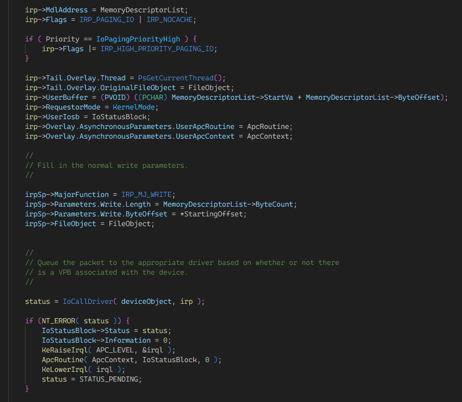

## 引言
<!-- markdownlint-capture -->
<!-- markdownlint-disable -->

> 阅读本文内容需要了解Windows内核，否则大概率会一脸懵逼。
{: .prompt-tip }
<!-- markdownlint-restore -->

相信搞Windows内核驱动开发的，都或多或少听说过 **IRQL** 这个东西，它的范围在 `0H~0FH` ，数值越大优先级越高，高优先级中断可以打断低优先级代码的执行，如果 IRQL为 `0FH`，则相当于清除了 **EFlags.IF**，代码的执行永远不会被打断，**NMI** 除外。

而 IRQL在x64下还有一个名字叫 **CR8** ，是从 **APIC** 映射过来的，不过本文章并不会详细说明这些东西，大家可以自行去查阅资料。

## 分页内存

而在Windows内核驱动开发的过程中，我们在微软的API文档中，经常会见到下面表格中的东西，这个表规定了哪些IRQL下可以使用这个API，违反这个规定，则有可能出现死锁或者蓝屏。

| Requirement     | Value            |
| --------------- | ---------------- |
| Target Platform | Universal        |
| Library         | NtosKrnl.lib     |
| DLL             | NtosKrnl.exe     |
| IRQL            | < DISPATCH_LEVEL |

其中DISPATCH_LEVEL下访问分页内存就是新手常犯的错误之一，当分页内存的物理页不存在的时候，需要通过触发#PF，来将磁盘中的内存读取到物理内存中，而读取的过程中，需要调用到MmAccessFault函数，这个函数会检查IRQL是否小于DISPATCH_LEVEL，如果不少于的话会直接调用KeBugCheckEx蓝屏。

## 文件读取

> Callers of **ZwReadFile** must be running at IRQL = PASSIVE_LEVEL and with special kernel APCs enabled.

有内核开发经验的朋友，应该有注意到过ZwReadFile这个API的文档下面，有这样一句话，这是因为文件系统的I/O完成是使用Special Kernel APC来实现的，如果当前IRQL处于APC下，或当前Special Kernel APC被禁用，则调用API会因为无法Complete而无限等待，也间接说明，文件读取的环境，必须可以交付Special Kernel APC。

## 新的问题

既然文件读取的环境，要求必须可以交付Special Kernel APC，为什么IRQL为APC_LEVEL的时候可以访问分页内存呢？访问分页内存的时候，系统不应该也会进行给文件系统发I/O请求吗？

这个问题的答案很简单，因为系统做过特殊的处理，下面我们直接来看Windows 2003的源码:

首先系统会调用IoPageRead去磁盘上读取分页内存。

------

这里我们看到IoPageRead是IopPageReadInternal的包装。

------

IopPageReadInternal的最后一个参数Async，表示PageRead的过程是异步还是同步，而IoPageRead传入的是FALSE，所以IoPageRead是同步的。

------

既然有同步，自然也有异步，IoAsynchronousPageRead，两者的区别后面会说。

------

IopPageReadInternal确实在做I/O操作，根据Async给不同的Flags，这个Flags在I/O Complete的时候会用到。

------

在IopfCompleteRequest里，找到了我们想要的东西，但是先前传入的Flags无论是同步还是异步，最后所执行的流程是完全一样的，都会去调KeSetEvent做同步处理，等于说IoAsynchronousPageRead和IoPageRead两个函数是没有任何区别的，IoAsynchronousPageRead并不是真的异步操作。

------

在MiPfExecuteReadList中用到了IoAsynchronousPageRead，但是不够，我们还需要在往上找。

------

再往上走一层，我们便可以知道为什么叫 **Asynchronous** ，因为它是一个预取列表有多个I/O操作，系统会同时等待全部I/O操作完成，这样性能更好，举个例子：

领导让你烧十壶水，烧完以后就可以下班了，那么你肯定不会烧一壶，等第一壶开了再烧第二壶，这样太笨了，你肯定是把十壶水同时放到炉子上去烧，然后等它们一起烧开。

但是说到底，IoAsynchronousPageRead的功能和IoPageRead确实完全相同，微软自己可能也发现了这一点，在后来的新版本Windows系统中，删除了这个函数，将原本用到它的地方换成了IoPageRead。

------

既然存在IoAsynchronousPageRead，那也存在IoAsynchronousPageWrite，但是和IoAsynchronousPageRead不同的是，IoAsynchronousPageWrite是一个真正的异步操作，使用Special Kernel APC异步调用IopCompletePageWrite来完成I/O操作。

## 文件关闭

有个小细节是，在IopPageReadInternal函数的Flags判断中，发现如果传入的Flags，带有IRP_CLOSE_OPERATION，也会直接去走同步的逻辑，而FileObject的CloseProcedure是IopCloseFile，IopCloseFile的实现也是I/O操作，会走和PageRead相似的逻辑。

## 结语

由此，我们便知道，PageRead依赖的的是Event，所以Apc并不会影响系统进行PageRead，而PageWrite才会真正依赖Apc。

