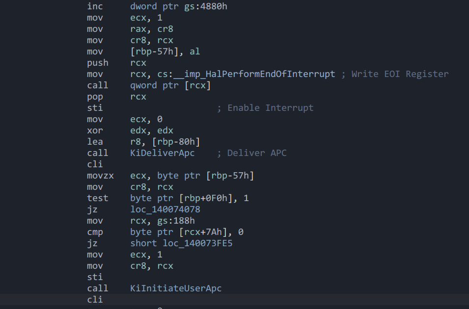

<!-- markdownlint-capture -->
<!-- markdownlint-disable -->

> 本文内容仅对于Delivery Mode为Fixed的中断消息。
{: .prompt-tip }
<!-- markdownlint-restore -->

本文将简单介绍在`xAPIC` `x2APIC` 的外部中断的接收过程，分为三个阶段，并说明各个阶段中寄存器的状态。

## Interrupt Acceptance

当一个外部中断路由到当前核心，并且当前核心是中断目标的时候，将IRR对应的Vector置位，让中断处于Pending状态，这个阶段不会受到PPR，EFLAGS.IF的影响，中断会Pending在队列中，等待Acknowledge。

## Interrupt Acknowledge

当EFLAGS.IF处于置位，中断窗口出现，并且IRR中有中断最高优先级大于PPR，则复位IRR对应的位，并且置位ISR中对应的位，然后通知CPU进行Delivery。

## Interrupt Delivery

此时原有的执行环境将被中断，CPU会根据当前IDT的IST来判断切换堆栈:

* 如果IST不为零，则切换到对应的IST。
* 否则判断CS是否发生了权限等级的切换:
  * 如果发生权限等级的切换，则切换等级对应TSS中的栈。
  * 否则不切换栈。

然后去执行对应的中断处理例程，操作系统应该在处理完成后写入EOI寄存器，清除ISR，并使用IRET返回，保证中断前的原始环境可以继续正常执行。

## Windows Interrupt

在Windows的内核中，存在两个特殊的中断，APC和DPC，它们由Windows自己定义为系统软中断，通过IDA逆向可以看到对于它们对于中断的处理方式。

* 将写入APC_LEVEL写入到TPR，此时保证TPR与最高优先级的ISR是相等的。

* 调用HalPerformEndOfInterrupt函数写入EOI，此时系统的PPR将由TPR控制。
* 开启中断窗口，保证可以进行下一个Interrupt Acknowledge。
* 此时如果存在比APC_LEVEL更高优先级的中断，则会中断在 `xor edx, edx` 执行前。
* 然后系统开始调度APC，调度APC的过程中降低TPR会导致被其他中断打断。

## Virtualization (VT-x)

在虚拟化环境中，如果Guest开启了External Interrupt Exiting，则VM-Exit发生在Acceptance以后，Acknowledge以前。

如果同时开启Acknowledge Interrupt On Exit，则VM-Exit发生在Acknowledge以后。

值得注意的是，由于External Interrupt Exiting本身不会考虑EFLAGS.IF，导致在Acknowledge以后发生的VM-Exit里，EFLAGS.IF依旧有可能是复位状态，此时如果将中断直接注入给Guest，会导致VM-Entry失败。