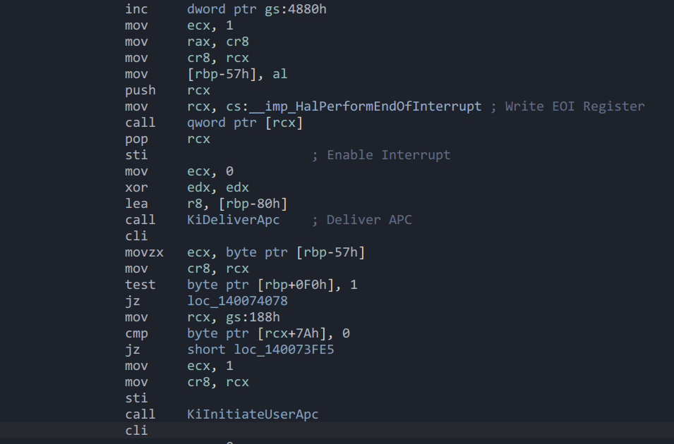

<!-- markdownlint-capture -->
<!-- markdownlint-disable -->

> 本文内容仅适用于 Delivery Mode 为 Fixed 的中断消息。
{: .prompt-tip }
<!-- markdownlint-restore -->

本文将简单介绍 `xAPIC` 和 `x2APIC` 中外部中断的接收过程，分为三个阶段，并说明各个阶段中寄存器的状态。

## Interrupt Acceptance

当一个外部中断路由到当前核心，并且当前核心是中断目标的时候，将 IRR 对应的 Vector 置位，让中断处于 Pending 状态，这个阶段不会受到 PPR，EFLAGS.IF 的影响，中断会 Pending 在队列中，等待 Acknowledge。

## Interrupt Acknowledge

当 EFLAGS.IF 处于置位状态、中断窗口出现，并且 IRR 中最高优先级的中断大于 PPR 时，则复位 IRR 对应的位，并且置位 ISR 中对应的位，然后通知 CPU 进行 Delivery。

## Interrupt Delivery

此时原有的执行环境将被中断，CPU 会根据当前 IDT 的 IST 来判断切换堆栈:

* 如果 IST 不为零，则切换到对应的 IST。
* 否则判断 CS 是否发生了权限等级的切换:
  * 如果发生权限等级的切换，则切换等级对应 TSS 中的栈。
  * 否则不切换栈。

然后去执行对应的中断处理例程，操作系统应该在处理完成后写入 EOI 寄存器，清除 ISR，并使用 IRET 返回，保证中断前的原始环境可以继续正常执行。

## Windows Interrupt

在 Windows 的内核中，存在两个特殊的中断，APC 和 DPC，它们由 Windows 自己定义为系统软中断，通过 IDA 逆向可以看到它们对中断的处理方式。

* 将 APC_LEVEL 写入到 TPR，此时保证 TPR 与最高优先级的 ISR 是相等的。

* 调用 HalPerformEndOfInterrupt 函数写入 EOI，此时系统的 PPR 将由 TPR 控制。
* 开启中断窗口，保证可以进行下一个 Interrupt Acknowledge。
* 此时如果存在比 APC_LEVEL 更高优先级的中断，则会中断在 `xor edx, edx` 执行前。
* 然后系统开始调度 APC，调度 APC 的过程中降低 TPR 会导致被其他中断打断。

## Virtualization (VT-x)

在虚拟化环境中，如果 Guest 开启了 External Interrupt Exiting，则 VM-Exit 发生在 Acceptance 以后，Acknowledge 以前。

如果同时开启 Acknowledge Interrupt On Exit，则 VM-Exit 发生在 Acknowledge 以后。

值得注意的是，由于 External Interrupt Exiting 本身不会考虑 EFLAGS.IF，导致在 Acknowledge 以后发生的 VM-Exit 里，EFLAGS.IF 依旧有可能是复位状态，此时如果将中断直接注入给 Guest，会导致 VM-Entry 失败。