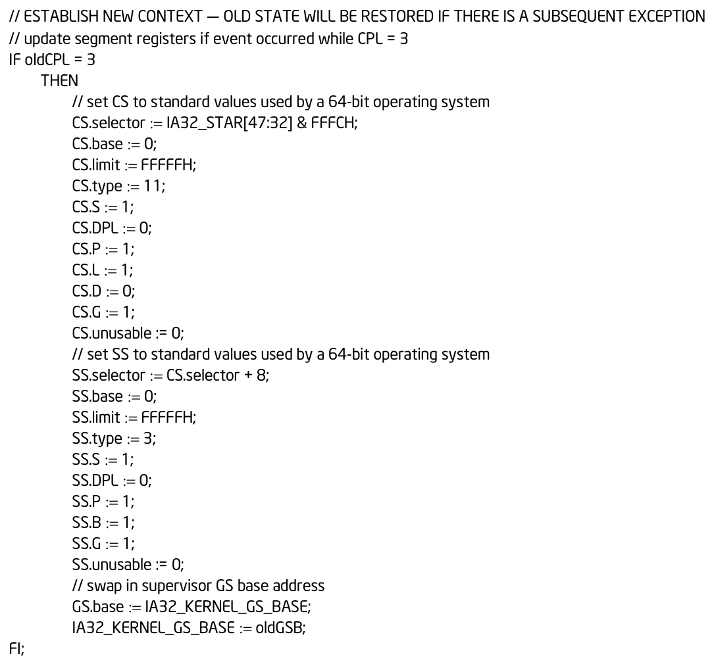

## 概述

**FRED（Flexible Return and Event Delivery）** 是 Intel 引入的新型特权级切换与事件处理架构，用于替代传统的 IDT 事件交付（IDT event delivery）和 IRET 返回机制，同时 AMD 也宣布在即将到来的 Zen6 中采用此功能，所以我认为有必要借此来简单介绍一下。

<!-- markdownlint-capture -->
<!-- markdownlint-disable -->

> 在阅读本篇内容前，需要读者对 x64 架构有一定的了解。
{: .prompt-tip }
<!-- markdownlint-restore -->

## 枚举

| 功能 | 支持                                      | 描述                   |
| ---- | ----------------------------------------- | ---------------------- |
| FRED | CPUID.(EAX=07H, ECX=1H):EAX.FRED [Bit 17] | 支持 FRED 指令和寄存器 |
| LKGS | CPUID.(EAX=07H, ECX=1H):EAX.LKGS [Bit 18] | 支持 LKGS 指令         |

<!-- markdownlint-capture -->
<!-- markdownlint-disable -->

> 这是两个独立的功能，任何支持 FRED 的处理器都将支持 LKGS。
{: .prompt-tip }
<!-- markdownlint-restore -->

## 启用

操作系统可以通过设置 **CR4.FRED[bit 32]** 来启用 FRED，启用后，传统 **IDT**、**SYSCALL**、**SYSENTER** 事件，都将统一转换成 **FRED** 事件。

> 开启与否，并不会影响 **LKGS** 指令，也不会影响 **RDMSR** 和 **WRMSR** 对于 **FRED MSR** 的访问。

<!-- markdownlint-capture -->
<!-- markdownlint-disable -->

> FRED 仅适用于 64 位操作系统（IA-32e 模式），而 AMD 在设计之初取消了 IA-32e 模式下的 SYSENTER 指令，所以猜测未来 FRED 事件中也不会存在 SYSENTER。
{: .prompt-tip }
<!-- markdownlint-restore -->

## 配置

| FRED MSR          | 地址        | 功能                              |
| ----------------- | ----------- | --------------------------------- |
| IA32_FRED_CONFIG  | 1D4H        | 配置 FRED 的功能                  |
| IA32_FRED_STKLVLS | 1D0H        | 异常向量各自的最低栈级别          |
| IA32_FRED_RSPn    | 1CCH - 1CFH | n= 0 - 3，各栈级别对应的 RSP      |
| IA32_FRED_SSPn    | 1D1H - 1D3H | n= 1 - 3，各栈级别对应的 SSP      |
| IA32_FRED_SSP0    | 6A4H        | 复用了原本 CET.SS 的 IA32_PL0_SSP |

- **IA32_FRED_CONFIG**：
  - **Bits 1:0**：当前栈级别（**CSL**）。
  
  - **Bit 3**：设置后，如果不进行栈切换，则将 **SSP** 递减 8。
  
  - **Bits 8:6**：不进行栈切换时 **RSP** 的递减量。
  
  - **Bits 10:9**：**CPL = 0** 时可屏蔽中断的栈级别。
  
  - **Bits 63:12**：事件处理入口，要求 **4K** 对齐。
  
- **IA32_FRED_STKLVLS**：
  - 代表的是 32 个异常向量在 **CPL = 0** 时使用的栈级别，每个向量占 2 位。
  
- **IA32_FRED_RSPn**：
  - 代表的是每个栈级别对应的 **RSP**。
  
- **IA32_FRED_SSPn**：
  - 代表的是每个栈级别对应的 **SSP**。

## 交付

首先，如果事件发生在 **CPL = 3**，则根据 **IA32_STAR [47:32]** 设置新的 **CS** 和 **SS**，然后交换 **GS.Base** 和 **IA32_KERNEL_GS_BASE**：

下一步为设置新的 **RIP**：

| RIP                              | 来源    | 描述                         |
| -------------------------------- | ------- | ---------------------------- |
| IA32_FRED_CONFIG & ~FFFH         | CPL = 3 | 使用 **ERETU**（返回用户态） |
| (IA32_FRED_CONFIG & ~FFFH) + 256 | CPL = 0 | 使用 **ERETS**（返回内核态） |

然后将 **RFLAGS** 设置为 **2**，随后设置 **RSP**、**SSP**、**CSL** 进行栈切换。

------

传统 **IDT** 的栈切换是依赖于 **TSS** 的，当中断或异常发生时，会根据以下因素决定是否进行栈切换：

- 如果中断 / 异常向量对应的 **IDT Entry** 的 **IST** 非零，则会无条件将 **RSP** 切换为 **TSS** 中 **IST** 字段对应的值。
- 否则，如果存在权限跃迁，就将 **RSP** 切换为 **TSS** 中 **RSP** 字段对应的值。
- 否则，不会进行栈切换。

而当开启 **FRED** 以后，栈切换方式会随之改变，并引入 **栈级别** 这个概念，FRED 事件发生时，首先会根据事件类型和 CPL 来确定 **eventSL**：

| 场景                                    | eventSL                    |
| --------------------------------------- | -------------------------- |
| CPL = 3，既不是嵌套异常，也不是双重异常 | 0                          |
| CPL = 3，是嵌套异常，或是双重异常       | IA32_FRED_STKLVLS[2v+1:2v] |
| CPL = 0，异常 / NMI                     | IA32_FRED_STKLVLS[2v+1:2v] |
| CPL = 0，外部中断                       | IA32_FRED_CONFIG[10:9]     |
| CPL = 0，INT n / SYSCALL / SYSENTER     | 0                          |

随后将 **CSL** 设置为 **MAX(CSL, eventSL)**，并根据以下因素决定是否进行栈切换：

- 如果事件发生在 **CPL = 3**，或 **CSL** 产生了变化，则将 **RSP** 切换为对应的 **IA32_FRED_RSP**，如果当前启用了 **KCET**，则同时将 **SSP** 切换为对应的 **IA32_FRED_SSP**。
- 否则，不进行栈切换，但是会根据 **IA32_FRED_CONFIG** 中用于控制 **RSP** 递减的位 **[8:6]** 和用于控制 **SSP** 递减的位 **[3]** 的配置来递减 **RSP** 和 **SSP**。手册并未提及这些字段的具体用途，猜测是在为 [Red Zone](https://en.wikipedia.org/wiki/Red_zone_(computing)) 预留空间。
